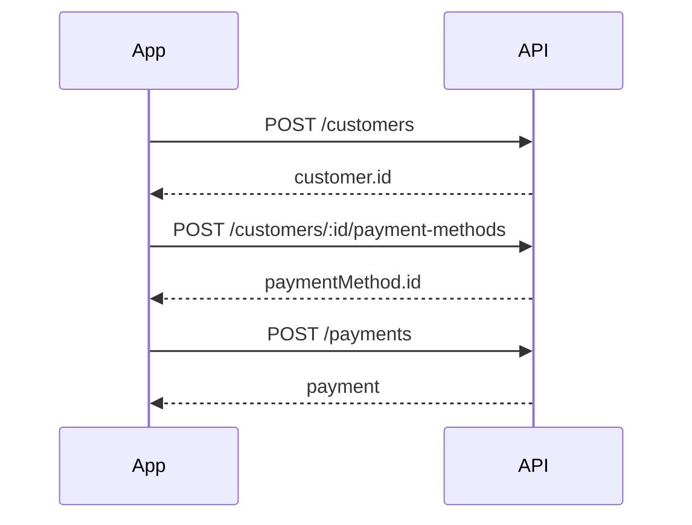

Este guia mostra o fluxo completo em sequência: criar um cliente, cadastrar um método de pagamento (cartão) e criar um pagamento. Use uma chave de API de teste e defina `UPAG_API_KEY` no ambiente (ou substitua no código). O exemplo chama a API nesta ordem: **Cliente** → **Método de pagamento** → **Pagamento**; os IDs retornados em cada passo são usados no seguinte.



## Exemplo

<CodeGroup>
```javascript Node
const API_KEY = 'sua_api_key_aqui';
const BASE_URL = 'https://api.upag.io/v1';

const headers = {
  'Content-Type': 'application/json',
  'Authorization': `Bearer ${API_KEY}`,
};

async function client(path, body) {
  const res = await fetch(`${BASE_URL}${path}`, {
    method: 'POST',
    headers,
    body: JSON.stringify(body)
  });
  if (!res.ok) throw new Error(await res.text());
  return res.json();
}

async function main() {
  // 1. Criar cliente
  const customerData = await client('/customers', {
    name: 'John Doe',
    email: 'john.doe@example.com',
    phone: '+1234567890'
  });

  // 2. Cadastrar método de pagamento (cartão)
  const paymentMethodData = await client(
    `/customers/${customerData.id}/payment-methods`,
    {
      type: 'credit_card',
      card: {
        number: '4242424242424242',
        expiryMonth: '12',
        expiryYear: '2032',
        cvv: '123',
        holderName: 'JOHN DOE'
      }
    }
  );

  // 3. Criar pagamento
  const paymentResult = await client('/payments', {
    customer: customerData.id,
    paymentMethod: paymentMethodData.id,
    amount: 1000, // R$ 10
    currency: 'brl',
    installments: 1
  });

  console.log('Pagamento criado:', paymentResult);
}

main();
```

```javascript SDK
import { Upag } from 'upag';

const upag = new Upag('sk_test_your_api_key');

// 1. Criar cliente
const customer = await upag.customers.create({
  name: 'John Doe',
  email: 'john.doe@example.com',
  phone: '+1234567890'
});

// 2. Cadastrar método de pagamento (cartão)
const paymentMethod = await upag.paymentMethods.create({
  customerId: customer.id,
  type: 'credit_card',
  card: {
    number: '4242424242424242',
    expMonth: 12,
    expYear: 2032,
    cvc: '123',
    holderName: 'JOHN DOE'
  }
});

// 3. Criar pagamento
const payment = await upag.payments.create({
  customerId: customer.id,
  paymentMethodId: paymentMethod.id,
  amount: 1000,
  currency: 'brl',
  installments: 1
});

console.log('Pagamento criado:', payment);
```
</CodeGroup>

Para detalhes dos parâmetros de cada endpoint, consulte: [Criar Cliente](/customers/create), [Criar Método de Pagamento](/payment-methods/create) e [Criar Pagamento](/payments/create).
